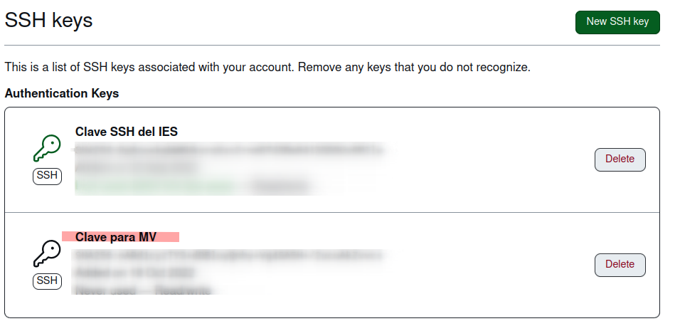

# 🔐 Configuración SSH para Git/GitHub desde una Máquina Virtual
<br>

**📑 Indice**
- [🔐 Configuración SSH para Git/GitHub desde una Máquina Virtual](#-configuración-ssh-para-gitgithub-desde-una-máquina-virtual)
  - [❓ ¿Qué es SSH?](#-qué-es-ssh)
  - [🛠️ 1. Generar Clave SSH](#️-1-generar-clave-ssh)
    - [📄 1.1 Creamos claves por el terminal](#-11-creamos-claves-por-el-terminal)
    - [🔁 1.2 Nos cambiamos de Fish a Bash](#-12-nos-cambiamos-de-fish-a-bash)
    - [🔑 1.3 Agregamos clave privada](#-13-agregamos-clave-privada)
  - [📩 2.1 Añadir clave SSH en GitHub](#-21-añadir-clave-ssh-en-github)
    - [📖 2.2 Leemos el fichero](#-22-leemos-el-fichero)
    - [⚙️ 2.3 Configuración en GitHub](#️-23-configuración-en-github)
    - [🔐 2.4 Apartado de claves SSH](#-24-apartado-de-claves-ssh)
    - [🆕 2.5 Crear nueva clave SSH](#-25-crear-nueva-clave-ssh)
    - [✍️ 2.6 Título y clave copiada](#️-26-título-y-clave-copiada)
  - [✅ 2.7 Clave creada correctamente](#-27-clave-creada-correctamente)

<br>

## ❓ ¿Qué es SSH?
<br>

``SSH (Secure Shell)`` es un protocolo de acceso remoto seguro que cifra toda la información que se transmite entre equipos.

📡 Su puerto por defecto es el ``22`` , y se utiliza para conexiones seguras entre máquinas , como por ejemplo desde tu máquina virtual a **GitHub** .

🔎 Puedes leer más en:

[Wikipedia - SSH](es.wikipedia.org/wiki/Secure_Shell)
<br>
<br>


## 🛠️ 1. Generar Clave SSH
<br>

### 📄 1.1 Creamos claves por el terminal
<br>


1 - 📄 Creamos claves por el terminal

  - Abre una terminal.

  - Asegúrate de estar en tu carpeta personal (home):

~~~~
pwd
~~~~
<br>
<br>


2 - Luego ejecuta el comando para generar la ``clave SSH`` .💡 El ``-C`` sirve para añadir un comentario (normalmente tu email).

~~~~
ssh-keygen -t ed25519 -C "tu-correo@ejemplo.com"
~~~~


<br>
<br>


### 🔁 1.2 Nos cambiamos de Fish a Bash
<br>


1 - 💡 Si estás usando ``fish shell`` , cambia temporalmente a Bash, ya que el agente ``SSH`` no siempre funciona correctamente en ``fish`` . Después de eso, puedes ejecutar el siguiente comando sin problemas .

~~~~
bash
~~~~


<br>
<br>


### 🔑 1.3 Agregamos clave privada
<br> 

1 - Para que la clave pueda ser usada por el sistema , la añadimos con :

~~~~
ssh-add ~/.ssh/id_ed25519
~~~~


<br> 
<br> 


## 📩 2.1 Añadir clave SSH en GitHub
<br>

Una vez generada la clave, debemos copiar la clave pública y añadirla a nuestra cuenta de **GitHub** .

⚠️ Importante: ¡Solo se comparte la clave pública, nunca la privada!
<br>
<br>


### 📖 2.2 Leemos el fichero
<br>

Copiamos la clave pública con . 🔍 Selecciona todo el contenido y cópialo :

~~~~
cat ~/.ssh/id_ed25519.pub
~~~~


<br>
<br>


### ⚙️ 2.3 Configuración en GitHub
<br>

  - Ve a tu cuenta de GitHub
  - Haz clic en tu foto de perfil (esquina superior derecha)
  - En el menú, entra a Settings


<br>
<br>


### 🔐 2.4 Apartado de claves SSH
<br>

En el menú lateral izquierdo, haz clic en :

  - SSH and GPG keys


<br>
<br>


### 🆕 2.5 Crear nueva clave SSH
<br>

Haz clic en el botón verde :

 - New SSH key


<br>
<br>


### ✍️ 2.6 Título y clave copiada
<br>

  - Pon un nombre para identificar tu clave (ej: VM Ubuntu)

  - Pega la clave pública en el cuadro inferior

  - Haz clic en Add SSH key


<br>
<br>


## ✅ 2.7 Clave creada correctamente

🎉 ¡Listo! Ya tienes tu clave ```SSH`` configurada en **GitHub** y puedes usar git clone, ``git push`` o ``git pull`` de forma segura y sin tener que escribir tu usuario y contraseña cada vez.

