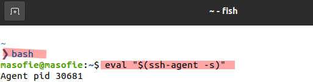
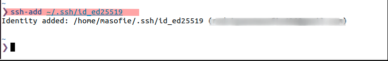
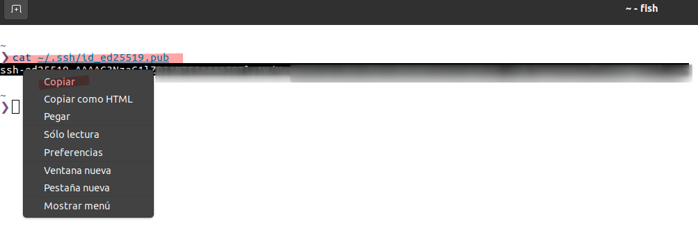
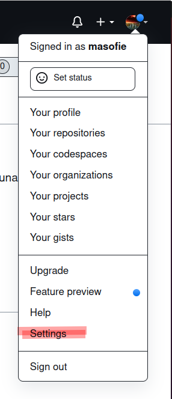
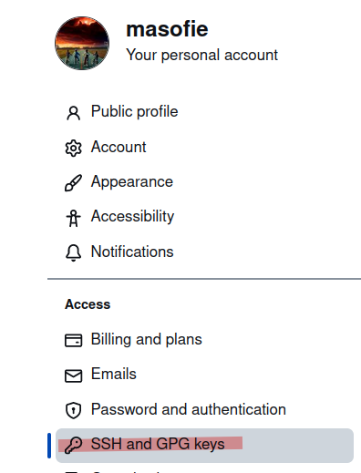
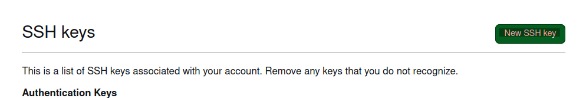
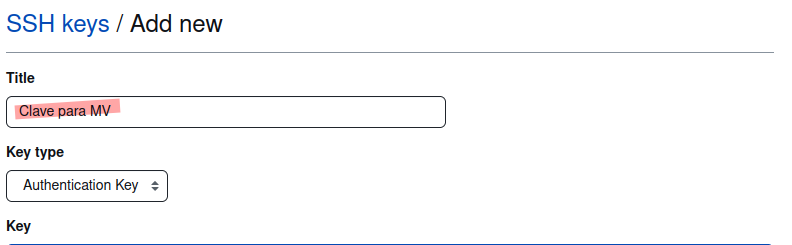

# Configuración SSH para Git/GitHub desde una Máquina Virtual

## ¿ Qué es SSH ?

El SSH , es un protocolo de acceso remoto que es utilizado mediante un canal seguro y que toda información esta cifrada .

El puerto estándar que utiliza es el 22 , para comunicarse remotamente desde una màquina .

Si quieres buscar mas información sobre SSH puedes buscar en el siguiente enlace .

**Enalce:** (**https://es.wikipedia.org/wiki/Secure_Shell**)

## Generar Clave SSH 

### Paso 1 

Abrir terminal y ejecutamos el siguiente comando para crear las claves . Y ejecutamos el siguiente comando :

Primero nos colocamos en nuestro home y hacemos un 

**`pwd** 

Y después ejecutamos el siguiente comando para crear las claves 

**`ssh-keygen -t ed25519 -C "tu correo electrónico"`**

### Paso 2 

Para ejecutar el siguiente comando , si estamos en fish . Tenemos que volver a bash y ejecutar el siguiente comando para inicial el agente ssh .

### Paso 3 

Agregamos clave privada , para eso utilizamos este comando 

**`ssh-add ~/.ssh/id_ed25519`**

## Añadiendo clave SSH en Git 

Para añadir la clave que acabas que crear en GitHUb, primero hay que copiar la clave para después pegrala y para eso utilizamos este comando .

Siempre vamos a subir la clave pública 

#### Paso 1 

**`cat ~/.ssh/id_ed25519.pub`**

#### Paso 2

Para añadir la clave pública lo primero que hay que hacer es  ir a nuestro GitHUb e ir a " **Configuración** " .

#### Paso 3

Después que estamos en la Configuración vamos a **SSH and GPG keys** 

#### Paso 4 

En la nueva ventana que se abrirá en la parte superior a la derecha le damos clic en **New SSH key**

#### Paso 5 

Por ultimo colocamos el titulo de nuestra clave y mas para abajo colocamos nuestra clave . Y le damos en crear .

