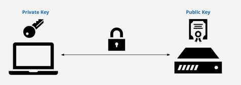

# Configuración SSH para Git/GitHub desde una Máquina Virtual

## Indice 

- [Configuración SSH para Git/GitHub desde una Máquina Virtual](#configuración-ssh-para-gitgithub-desde-una-máquina-virtual)
  - [Indice](#indice)
  - [¿ Qué es SSH ?](#-qué-es-ssh-)
  - [Generar Clave SSH](#generar-clave-ssh)
      - [Creamos claves por el Terminal](#creamos-claves-por-el-terminal)
      - [Nos cambiamos de Fish a Bash](#nos-cambiamos-de-fish-a-bash)
      - [Agregamos Clave Privada](#agregamos-clave-privada)
  - [Añadiendo clave SSH en Git](#añadiendo-clave-ssh-en-git)
      - [Leemos Fichero](#leemos-fichero)
      - [Configuración de Github](#configuración-de-github)
      - [Apartado de Claves SSH](#apartado-de-claves-ssh)
      - [Creamos nueva Clave SSH](#creamos-nueva-clave-ssh)
      - [Titulo y Clave Copiada](#titulo-y-clave-copiada)
  - [Clave creada](#clave-creada)

## ¿ Qué es SSH ?

El SSH , es un protocolo de acceso remoto que es utilizado mediante un canal seguro y que toda información esta cifrada .

El puerto estándar que utiliza es el 22 , para comunicarse remotamente desde una màquina .

Si quieres buscar mas información sobre SSH puedes buscar en el siguiente enlace .

**Enalce:** (**https://es.wikipedia.org/wiki/Secure_Shell**)

## Generar Clave SSH 

#### Creamos claves por el Terminal

Abrir terminal y ejecutamos el siguiente comando para crear las claves . Y ejecutamos el siguiente comando :

Primero nos colocamos en nuestro home y hacemos un 

**`pwd`** 

Y después ejecutamos el siguiente comando para crear las claves 

**`ssh-keygen -t ed25519 -C "tu correo electrónico"`**

#### Nos cambiamos de Fish a Bash 

Para ejecutar el siguiente comando , si estamos en fish . Tenemos que volver a bash y ejecutar el siguiente comando para inicial el agente ssh .

#### Agregamos Clave Privada 

Agregamos clave privada , para eso utilizamos este comando 

**`ssh-add ~/.ssh/id_ed25519`**

## Añadiendo clave SSH en Git 

Para añadir la clave que acabas que crear en GitHUb, primero hay que copiar la clave para después pegrala y para eso utilizamos este comando .

Siempre vamos a subir la clave pública 

#### Leemos Fichero 

**`cat ~/.ssh/id_ed25519.pub`**

#### Configuración de Github 

Para añadir la clave pública lo primero que hay que hacer es  ir a nuestro GitHUb e ir a " **Configuración** " .

#### Apartado de Claves SSH

Después que estamos en la Configuración vamos a **SSH and GPG keys** 

#### Creamos nueva Clave SSH

En la nueva ventana que se abrirá en la parte superior a la derecha le damos clic en **New SSH key**

#### Titulo y Clave Copiada  

Por ultimo colocamos el titulo de nuestra clave y mas para abajo colocamos nuestra clave . Y le damos en crear .

## Clave creada 

Aqui podmeos ver que se ha copiado correctamente en nuestro GitHub

